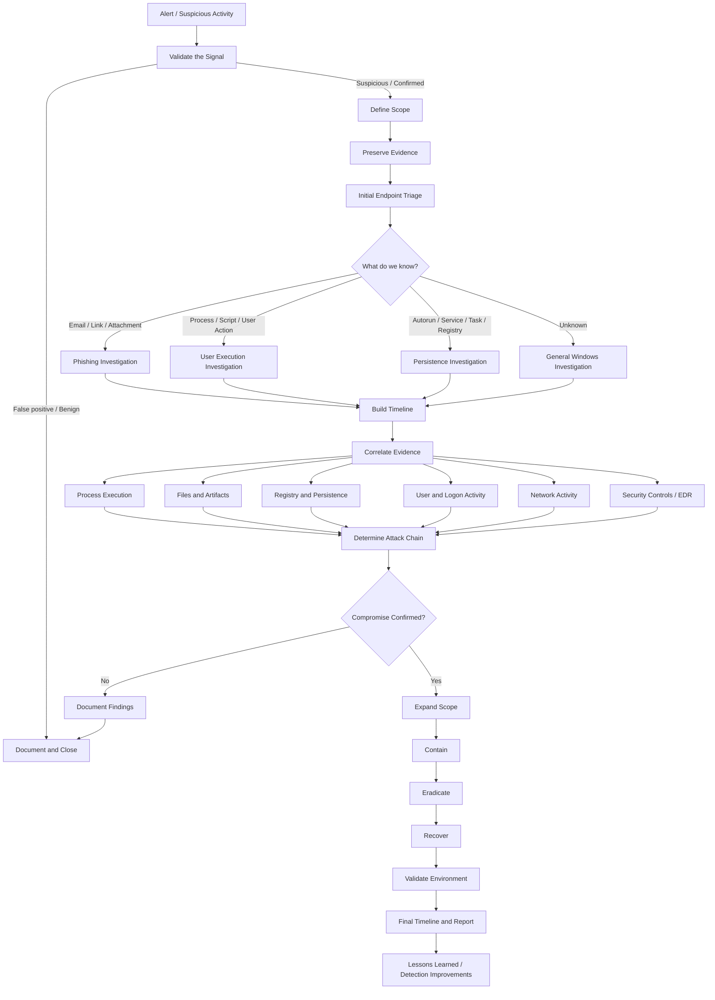

# DFIR Windows Investigation Scheme

> [!note]
> This page is a high-level investigation map. It is intentionally generic and will evolve as individual Windows DFIR playbooks are expanded.

## Investigation Flow



## Core Workflow

### 1. Validate the Signal

Determine whether the original alert or observation represents:

- [ ] Benign activity
- [ ] Suspicious activity requiring additional investigation
- [ ] Confirmed malicious activity
- [ ] Known administrative or business activity
- [ ] Detection logic requiring tuning

Record the original source of the case:

- EDR / XDR alert
- SIEM correlation
- Antivirus detection
- User report
- Email security alert
- Network detection
- Threat hunting finding
- External notification

---

### 2. Define Scope

Identify what is currently known.

- [ ] Hostname
- [ ] User account
- [ ] IP address
- [ ] Alert timestamp
- [ ] Detection source
- [ ] Process name
- [ ] Process command line
- [ ] Parent process
- [ ] File path
- [ ] File hash
- [ ] URL / Domain / IP
- [ ] Email sender / recipient
- [ ] Initial suspected technique

Do not assume the first detected endpoint is the only affected endpoint.

---

### 3. Preserve Evidence

Before remediation, preserve evidence when operationally possible.

Typical evidence sources:

- Windows Event Logs
- EDR / XDR telemetry
- Process tree
- File metadata and hashes
- Registry artifacts
- Scheduled Tasks
- Services
- Prefetch
- Amcache
- Shimcache / AppCompatCache
- SRUM
- Browser history
- PowerShell logs
- Defender / AV logs
- Network telemetry
- Email metadata
- Memory image when required
- Disk image when required

> [!warning]
> Containment may be more important than evidence preservation during an active compromise. Record any action that changes the state of the endpoint.

---

### 4. Initial Endpoint Triage

Establish the basic incident context.

- [ ] Who executed the activity?
- [ ] What process started it?
- [ ] When did it start?
- [ ] Where did the file or command originate?
- [ ] What happened immediately before it?
- [ ] What happened immediately after it?
- [ ] Did the process create children?
- [ ] Did it create or modify files?
- [ ] Did it modify the registry?
- [ ] Did it create persistence?
- [ ] Did it communicate externally?
- [ ] Did it access credentials?
- [ ] Did it connect to other internal systems?

---

## Investigation Entry Points

### Phishing

Use the dedicated playbook when the incident originates from an email, attachment, link, QR code, or other phishing delivery mechanism.

**Playbook:** [[Phishing]]

Focus on:

- Sender and message origin
- Recipient scope
- URLs and redirects
- Attachments
- Browser activity
- Downloaded payloads
- Child processes from Office applications or browsers
- Credential exposure
- Similar messages delivered to other users

---

### User Execution

Use the dedicated playbook when execution depends on user interaction or when a suspicious process, script, installer, document, shortcut, archive, or command was launched.

**Playbook:** [[User Execution]]

Focus on:

- Parent-child process relationship
- Command line
- Execution timestamp
- File origin
- Zone.Identifier
- Browser download history
- LNK files
- Recent files
- Prefetch
- Amcache
- PowerShell / CMD activity
- Script interpreters
- LOLBins
- User context

---

### Persistence

Use the dedicated playbook when there is evidence that an attacker or suspicious application attempted to survive reboot, logoff, or process termination.

**Playbook:** [[Persistence]]

Focus on:

- Run / RunOnce keys
- Startup folders
- Scheduled Tasks
- Windows Services
- WMI persistence
- PowerShell profiles
- Logon scripts
- Winlogon modifications
- IFEO
- COM hijacking
- DLL search-order abuse
- Browser extensions
- Local accounts
- Remote access tools

---

### Unknown Entry Point

When the initial access or execution method is unknown, start with broad endpoint triage and work backward from the strongest known artifact.

Recommended pivot order:

1. Detection timestamp
2. Process tree
3. User logon session
4. File creation
5. Network connection
6. Registry modification
7. Persistence artifact
8. Earlier related execution
9. Initial access evidence

---

## Evidence Correlation

Do not evaluate individual artifacts in isolation.

### Process Execution

Correlate:

- Process name
- Full path
- Parent process
- Child processes
- Command line
- User context
- Integrity level
- Signature
- Hash
- First / last execution evidence

### Files and Artifacts

Correlate:

- Creation time
- Modification time
- File owner
- Alternate Data Streams
- Zone.Identifier
- Hash reputation
- Digital signature
- Prefetch
- Amcache
- Recent files
- LNK files

### Registry and Persistence

Correlate:

- Registry modification time
- Executable path
- User hive vs system hive
- Related process execution
- Scheduled Task creation
- Service creation
- Startup locations

### User and Logon Activity

Correlate:

- Interactive logons
- Remote logons
- RDP
- SMB
- Service logons
- Scheduled Task logons
- Privileged logons
- Account creation
- Group membership changes
- Credential use

### Network Activity

Correlate:

- Destination IP
- Domain
- Port
- Protocol
- DNS resolution
- Proxy records
- Firewall logs
- EDR network telemetry
- TLS / certificate metadata where available
- Internal lateral movement

---

## Build the Timeline

The goal is to reconstruct the sequence of events, not just list artifacts.

```text
Initial Access
    ↓
User / System Execution
    ↓
Payload or Script Execution
    ↓
Persistence
    ↓
Privilege / Credential Activity
    ↓
Discovery
    ↓
Lateral Movement
    ↓
Command and Control
    ↓
Collection / Exfiltration
    ↓
Impact
```

For each relevant event, record:

| Field | Value |
|---|---|
| Timestamp | |
| Host | |
| User | |
| Process / Artifact | |
| Action | |
| Source | |
| Related IOC | |
| Confidence | |
| Notes | |

---

## Determine the Attack Chain

At this stage, answer the following questions:

- [ ] What was the initial entry point?
- [ ] What was the first confirmed malicious execution?
- [ ] Which user account was involved?
- [ ] Was privilege escalation observed?
- [ ] Was persistence established?
- [ ] Were credentials accessed or dumped?
- [ ] Was lateral movement attempted?
- [ ] Was command-and-control communication observed?
- [ ] Was data collected?
- [ ] Was data exfiltrated?
- [ ] Was destructive activity observed?
- [ ] Which endpoints or accounts are affected?
- [ ] What is still unknown?

---

## Scope Expansion

If compromise is confirmed, search for the same indicators across the environment.

Pivot on:

- File hashes
- File names
- File paths
- Domains
- IP addresses
- URLs
- Command-line fragments
- Registry paths
- Scheduled Task names
- Service names
- User accounts
- Parent-child process patterns
- Email subjects
- Sender addresses
- Attachment names

The investigation should move from:

```text
Single Alert
    ↓
Single Endpoint
    ↓
Related User
    ↓
Related Endpoints
    ↓
Environment-Wide Scope
```

---

## Containment

Containment actions depend on the incident and environment.

Possible actions:

- [ ] Isolate endpoint
- [ ] Disable compromised account
- [ ] Reset credentials
- [ ] Revoke active sessions
- [ ] Block malicious hash
- [ ] Block domain / IP / URL
- [ ] Quarantine malicious email
- [ ] Disable malicious scheduled task
- [ ] Stop malicious service
- [ ] Stop malicious process
- [ ] Restrict lateral movement
- [ ] Preserve required forensic evidence

> [!important]
> Record who performed each containment action and when it was performed.

---

## Eradication

Remove confirmed malicious components only after their role in the attack chain is understood.

- [ ] Remove malicious files
- [ ] Remove persistence
- [ ] Remove unauthorized accounts
- [ ] Remove malicious services
- [ ] Remove malicious scheduled tasks
- [ ] Remove malicious registry entries
- [ ] Remove unauthorized remote-access tools
- [ ] Patch exploited vulnerability
- [ ] Correct exposed configuration
- [ ] Rotate affected credentials
- [ ] Update detections and blocks

---

## Recovery

Return systems to normal operation only after validating that the compromise has been removed.

- [ ] Reconnect endpoint
- [ ] Validate security controls
- [ ] Confirm EDR / AV operation
- [ ] Verify logging
- [ ] Verify user access
- [ ] Monitor for recurring indicators
- [ ] Confirm no persistence remains
- [ ] Confirm no suspicious outbound communication remains

---

## Investigation Closure

The final case should contain:

- Incident summary
- Initial detection
- Scope
- Affected systems
- Affected users
- Root cause
- Initial access
- Execution chain
- Persistence
- Network activity
- Credential activity
- Lateral movement
- Data access / exfiltration
- Containment actions
- Eradication actions
- Recovery actions
- Complete timeline
- Indicators of compromise
- MITRE ATT&CK mapping
- Detection gaps
- Recommended improvements
- Remaining unknowns

---

## Quick Navigation

- [[Phishing]]
- [[User Execution]]
- [[Persistence]]

---

## Working Principle

> Start from the strongest known artifact, build the timeline in both directions, correlate independent evidence sources, and expand the scope until the complete attack chain is understood.
